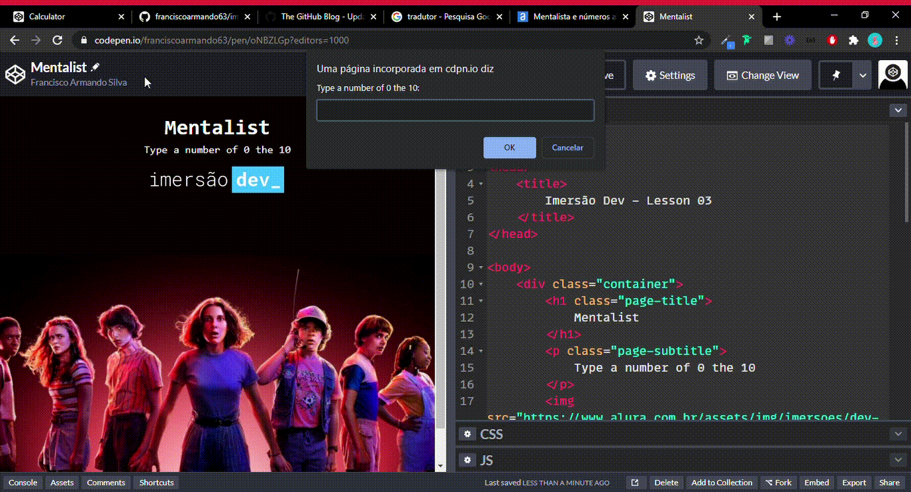

<h1
  align="center"
>
  
</h1>

<h3
  align="center"
>
  Dev Immersion is an immersion of Alura for Beginners in Programming and for those who wish to review the initial concepts.
</h3>

 
 

<h2
  align="center"
>
  CLASS THREE - Mentalist and Random Numbers
</h2>

 
<h1
  align="center"
>
  
</h1>

### Access my code at CodePen by clicking [here](https://codepen.io/franciscoarmando63/pen/oNBZLGp?editors=0010)

 

### In this third class of Dev Immersion, we will create a guessing game, where the program chooses a random number and we will try to get it right

 

<strong>
  CHALLENGES OF THE CLASS
</strong>

 

* Modify the mentalist's scenario and components of alternatives, points and etc.

* The break statement can be replaced so that the code exits while while without it. Can you think of an alternative?

* Change math.random () to work with other intervals between numbers.
